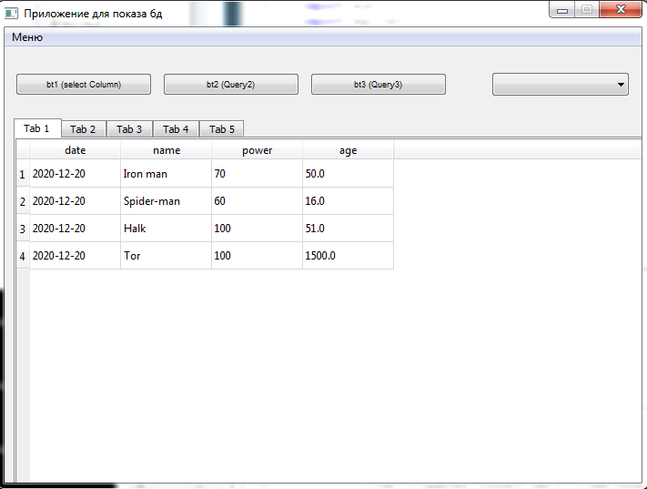

# Lab 4 GUI
Реализовать приложение на PyQt с использованием представления таблиц и работы с SQL.
В меню две вкладки: Set connection (установить соединение с бд), Close connection (очистить все, закрыть соединение с бд).
По умолчанию можно сделать в QTabWidget вкладки пустыми, либо создавать их по выполнению запросов при нажатии на функциональные клавиши.
Сразу после успешного коннета в Tab1 устанавливается таблица, соответствующая запросу «SELECT * FROM sqlite_master».
Кнопка bt1 делает выборочный запрос, например, «SELECT name FROM sqlite_master», результат выводится в Tab2.
При выборе колонки из выпадающего списка QComboBox результат соотвествующего запроса отправляется в Tab3.
Кнопки bt2 и bt3 выполняют запрос по выводу таблицы в Tab4 и Tab5

# Пример

